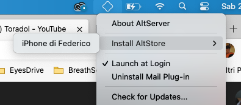
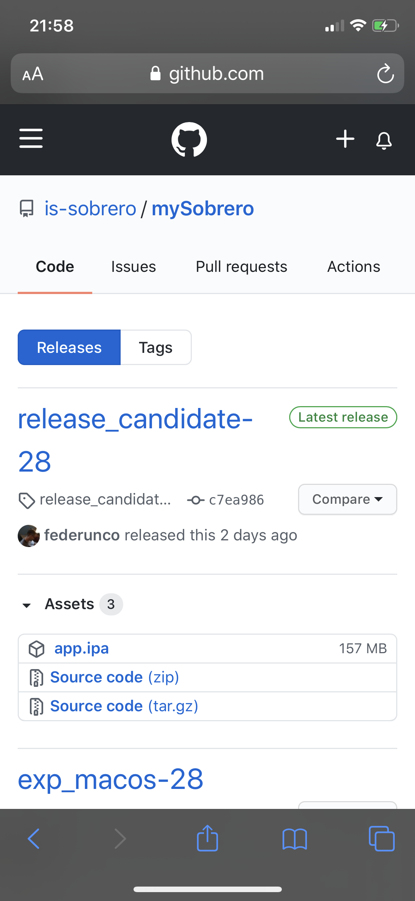
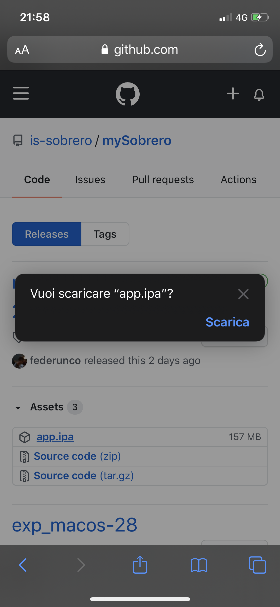
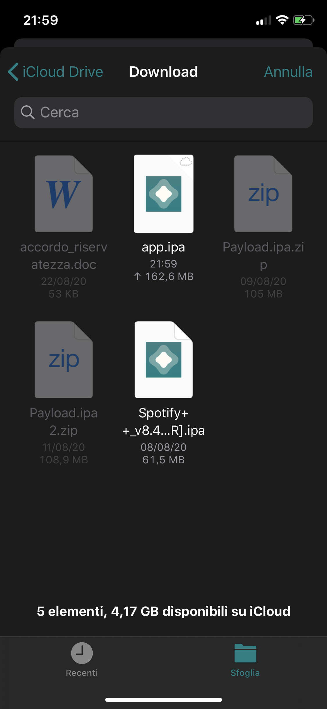

## Installazione di mySobrero su iPhone con AltStore
mySobrero non è ancora disponibile nell'Apple App Store. Per provare l'app senza dover scaricare tutti i pacchetti e ricompilare, è possibile eseguire questa procedura.

### Cos'è AltStore
AltStore è negozio delle applicazioni per iOS che permette l’installazione di app e giochi senza avere il jailbreak.

AltStore è diverso da tutti gli altri perché non viene mai bloccato e funziona sempre, anche se Apple blocca le firme. Infatti in pochi minuti tutto viene ripristinato, poiché la modifica è fatta direttamente sull’account master che abilitata tutti gli account Apple a diventare sviluppatori, per ripristinare il funzionamento senza blocchi.

Per installare app da fonti esterni all’AppStore usando un account sviluppatore, è possibile farlo senza jailbreak e senza limiti per 7 giorni ed AltStore non fa altro che rinnovare in maniera illimitata questo tempo. Così facendo funzionano sempre e senza limiti, senza essere mai bloccate.

### Prima di iniziare
#### Se stai usando Windows
Installa una versione di iTunes e iCloud (non da Microsoft Store) prima di continuare.
[Link Windows x64](https://www.apple.com/itunes/download/win64)
[Link Windows x32](https://www.apple.com/itunes/download/win32)
[iCloud](https://support.apple.com/it-it/HT204283)
#### Se stai usando macOS Big Sur Beta
AltServer 1.3 non funziona su Big Sur, è disponibile una beta di AltServer 1.4 compatibile, che
però richiede la disattivazione di importanti misure di sicurezza di macOS.
[Download versione 1.4 Big Sur](https://altstore.io/altserver/beta/)

### Installazione AltServer
Scarica AltServer dal [Sito ufficiale](https://altstore.io/) e installalo.

Una volta finito il setup dovresti vedere una icona a forma di rombo
- In alto a destra su macOS
- In basso a destra, nell'area delle notifiche, su Windows

### Installazione AltStore su iPhone
Collega iPhone al computer con un cavo originale.

Clicca sull'icona a forma di rombo, e recati sul sottomenu "Install AltStore", da qui seleziona il tuo iPhone

Inserisci l’email e la password del tuo ID Apple, ora dovrai attendere qualche secondo affinché AltStore venga installato sul tuo iPhone.

### Installazione mySobrero su iPhone
Recarsi sull'iPhone su [https://github.com/is-sobrero/mySobrero/releases](https://github.com/is-sobrero/mySobrero/releases) con Safari e scaricare l'ultima
release disponibile di mySobrero.

&nbsp;

Aprire AltStore e cliccare sul pulsante "+" in alto a destra, selezionare il file "app.ipa" precedentemente scaricato, ora AltStore installerà mySobrero.
E' possibile che venga richiesto l'ID Apple.

### Durata installazione
L'installazione con ID Apple Sviluppatore gratuito dura 7 giorni, AltStore manderà una notifica, prima che scada il termine, per invitarvi a rinnovare
la durata dell'installazione.